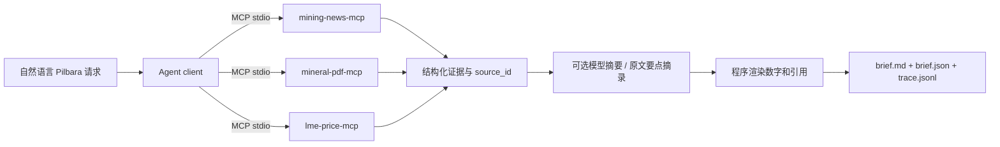

# 架构与工程说明

## 运行链路

一个 client 依次启动三个独立 server 进程，使用官方 SDK `ClientSession`，每个都完成 initialize、tools/list、tools/call。容器仅是运行环境，没有用 Python 函数直连伪装 MCP。服务端业务 provider 内部函数调用是正常实现边界。

选择固定流程而非无限循环 ReAct：题目目标和五个工具确定，固定链路减少不必要调用并容易验收。实体识别首版覆盖 Pilbara、PLS、Pilgangoora、皮尔巴拉；不支持实体时明确报错，避免串项目。

## 工具契约

| 服务 | 工具 | 输入 | 限制 |
| --- | --- | --- | --- |
| mining-news-mcp | search | query: string, days: integer | query 1–200 字符；days 1–90 |
| mining-news-mcp | fetch_article | url: string | 登记原文或已发现且允许的来源 |
| mineral-pdf-mcp | extract_resources | pdf_url: string | 已核验版式；最多 300 页，35 MB |
| lme-price-mcp | get_price | commodity: string, date: YYYY-MM-DD | lithium_hydroxide 别名；最多回退七天 |
| lme-price-mcp | get_trend | commodity: string, days: integer | 2–90 日历日，固定合约 |

所有成功及业务错误返回同一封装：`schema_version/status/data/sources/warnings/error/meta`。status 为 ok、partial、empty、error。错误包含安全消息、代码、可重试标记；调用参数校验或 MCP 协议错误可能由 SDK 直接返回。

来源包含 source_id、原文 URL、标题、发行人、资料日期、PDF 页码。资源记录包含原类别、矿石量与单位、品位与单位、含金属量与单位、口径、原文证据和解析状态。价格用 Decimal 字符串输出，附观察日期、合约月份、报价类型、币种和单位。

## 工程规范

- 分层：CLI 配置、Agent 编排、MCP 通信、server、provider、schema、模型、渲染各自独立；数据错误不被吞成成功。
- 依赖：`pyproject.toml` 描述兼容范围，`uv.lock` 锁定实际版本；Docker 基础镜像固定已验证 digest，uv 固定版本，应用代码和证据文件只读，输出目录单独可写。
- 质量：Ruff 代码规范与格式、mypy strict（src）、pytest 单元/真实 stdio 集成；CI 覆盖原文下载和 Docker 主流程。
- 可追溯：run_id、工具名、参数、状态、耗时和来源 ID 写入 JSONL；服务日志写 stderr；每次执行独立输出目录。
- 安全：HTTPS 主机白名单、公网 DNS 检查、每跳重定向检查、35 MB 下载上限、PDF 页数限制、路径越界检查、原文哈希校验。
- 版本：demo/live 使用相同的登记原文哈希约束；PDF adapter 额外核对原文有效日期。正文下载失败时保留已缓存的有效 RSS 摘要并返回 partial，无摘要时保持错误。
- 配置与密钥：`.env` 和本机 MCP 配置被 Git 忽略；Agent 启动子进程时只传运行必要变量，模型密钥不传给服务；异常不打印 HTTP 请求内容。
- 运行：非 root Docker 用户、无业务端口暴露、单次 Agent 最长 300 秒、工具调用 60 秒、会话在异常/取消时关闭。下载单次读取超时默认 20 秒，构建时 60 秒；仅网络异常、429 和服务端错误最多尝试三次，退避 0.5/1 秒；来源和哈希错误不重试。构建缓存下载材料，每次使用前仍校验哈希。
- 交付：源码包按文件白名单排除原文、日志、密钥、虚拟环境和个人临时文件；离线包额外附带运行镜像、哈希及镜像身份。离线 Compose 禁止联网与自动拉取，导入后直接运行。

工具级业务失败会继续收集其他类型证据并生成 partial 日报。MCP 服务启动、协议错误或总流程超时导致 failed，CLI 非零退出，保留已写轨迹供排查。`--strict` 对 partial 返回非零退出码；模型不可用时证据模板仍可完整展示数据。

## 模型约束

模型仅处理公开文本摘要和有证据来源的风险解释。外部文本按不可信内容处理，提示模型忽略其中指令。结构化输出要求文章 ID 全覆盖、无重复、引用 ID 有效；禁止模型写阿拉伯数字、URL、引用编号和 HTML 标记，数字和链接统一由程序填入。

这些检查能约束格式和引用，不能证明每一句模型自然语言都语义正确。`examples/brief.md` 的模型摘要经过本次人工比对正文；其他运行仍需读者结合引用审阅。没有把模型命名为专业储量审核系统。

## 首版边界

这是按企业工程习惯组织的面试 Demo，首版不包含数据库、用户账户、前端、定时调度、多租户、自动发现最新项目报告或任意 PDF OCR。没有承诺生产 SLA。网络白名单和 DNS 检查不是完整的生产出网代理隔离；生产扩展需单独设计基础设施与访问策略。

后续主要扩展点是 provider adapter、项目 manifest 和模型服务配置。完整在线日报优先补齐持续可用的当前行情、项目披露更新与新闻来源；不需要重写 MCP 契约。
